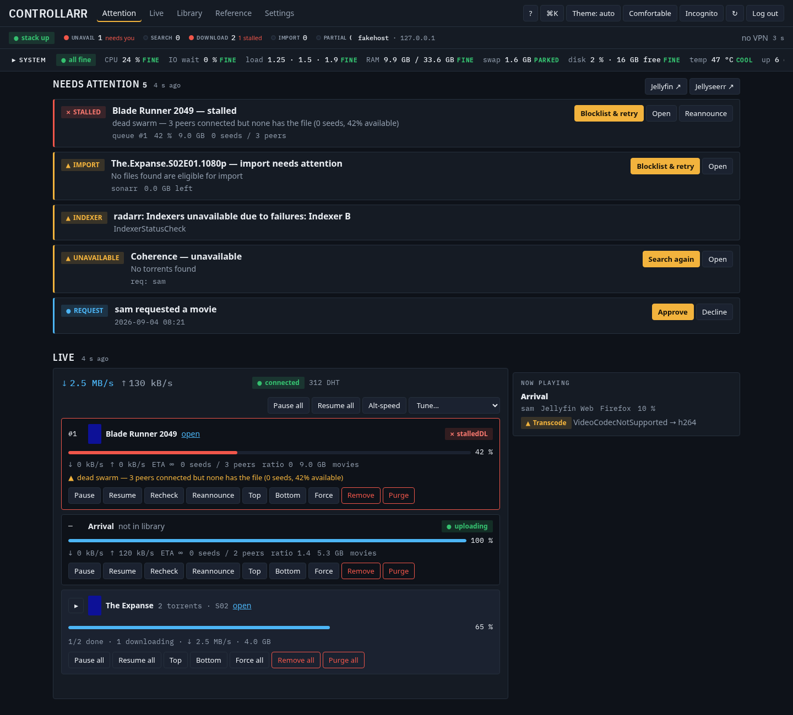

# media-stack

A self-hosted media library that runs itself: request a film or a show, and it is
found, subtitled and playing in Jellyfin. One script installs it, one removes it.



## Quick start

Linux with Docker and the compose plugin, `python3`, `curl`, `git`.

```bash
git clone https://github.com/lochlannfoster/media-stack.git
cd media-stack
./install.sh
```

Re-run `./install.sh` to change anything — previous answers are the defaults,
passwords are kept. `./uninstall.sh` removes it all.

## What you get

| Service | Address | Role |
|---|---|---|
| [Controllarr](docs/services/controllarr.md) | `localhost:3002` | Control panel — what needs you, the library, settings |
| [Jellyfin](docs/services/jellyfin.md) | `localhost:8096` | Watch |
| [Jellyseerr](docs/services/jellyseerr.md) | `localhost:5055` | Request |
| [Radarr](docs/services/radarr.md) / [Sonarr](docs/services/sonarr.md) | `localhost:7878` / `localhost:8989` | Film / TV automation |
| [Bazarr](docs/services/bazarr.md) | `localhost:6767` | Subtitles |
| [autoheal](docs/services/autoheal.md) | — | Restarts unhealthy containers |
| [ntfy](docs/services/ntfy.md) | `localhost:8090` | Phone notifications (optional) |
| [Tailscale](docs/services/tailscale.md) | — | Private remote access (optional) |
| [gluetun](docs/services/gluetun.md) | — | VPN tunnel for Radarr/Sonarr/Bazarr's outbound traffic (optional) |

`localhost` is the server; from another device use its LAN address. Ports are
`*_PORT` in `.env`. LAN-only by design.

## Bring your own sources

Radarr and Sonarr need somewhere to search and something to fetch with. This
installer configures **neither** — no indexer and no download client ship with it,
and it never touches yours. Add them in Radarr and Sonarr (or an indexer manager of
your choosing) and everything else here works around them.

Until you do, the stack still runs: Jellyfin plays what is already on disk,
Jellyseerr takes requests and the arrs track them.

## Through a VPN, if you want

The three services that talk to third parties — Radarr, Sonarr and Bazarr — can be
routed through a [gluetun](docs/services/gluetun.md) tunnel, so their metadata,
indexer and subtitle traffic leaves through your VPN provider instead of your ISP
connection. Any of gluetun's ~50 providers works; your existing subscription
almost certainly does.

Write your provider's settings into `vpn.env`, then `./install.sh` → *VPN* → yes.
gluetun owns the firewall for the containers it routes, so **when the tunnel drops
they have no network at all** — that is the point. Jellyfin and Jellyseerr are
never routed: one serves your LAN, the other talks to TMDB. Nothing is forwarded
inbound. [Details and a worked `vpn.env`](docs/services/gluetun.md).

## Extending it

`MEDIA_STACK_OVERLAY=<dir> ./install.sh` lets a private overlay add its own
services, prompts, wiring and cron jobs on top of this stack without forking it —
see [Development ▸ Overlays](docs/DEVELOPMENT.md#5-overlays).

## Documentation

[Install](docs/INSTALL.md) · [Configuration](docs/CONFIGURATION.md) · [Services](docs/SERVICES.md) ·
[Automation](docs/AUTOMATION.md) · [Backup and restore](docs/BACKUP-RESTORE.md) ·
[Troubleshooting](docs/TROUBLESHOOTING.md) · [Uninstall](docs/UNINSTALL.md) · [Development](docs/DEVELOPMENT.md)

## Licence

GPL-3.0, the same licence as Radarr, Sonarr, Prowlarr and Bazarr.
